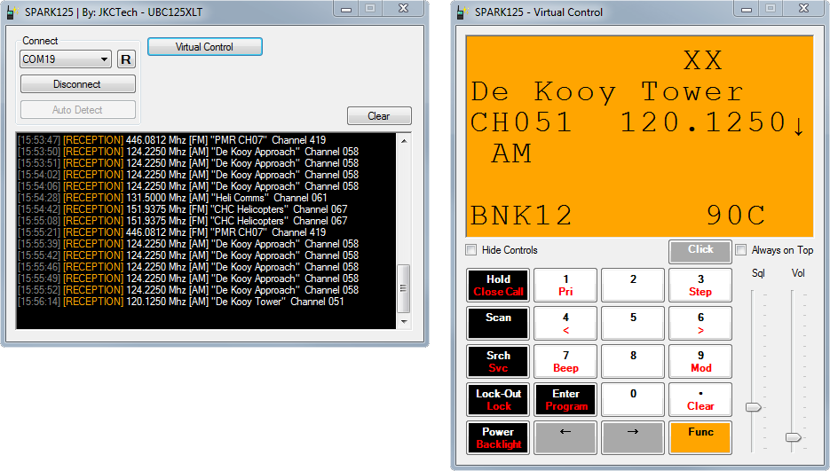

# SPARK125 

### ⚠️ WORK IN PROGRESS
```
This project is still in active development.
Some parts might not work well, or not at all.
Please keep an eye on the **Releases** tab.
```

**Free** alternative management software for Uniden Bearcat scanners.



**Compatible with:**
- BC125AT *(Not Tested)*
- UBC125XLT
- UBC126AT *(Not Tested)*
- AE125H *(Not Tested)*

## Features
- **Virtual Control** - Control your scanner over USB

### Planned Features
- **Terminal** - Directly interface with the scanner
- **Bank Management** - Read / write to the scanner's memory banks
- **Settings Management** - Manage your scanner's settings

<hr>

#### Getting Started

<a href="SPARK125/"><h5>> Read More</h5></a>

<hr>

#### Documentation
Documents and reference sheets I found / created that are useful for development with the scanners.
<a href="Documentation/"><h5>> Read More</h5></a>

<hr>

#### Tools
Small (Python) tools that can dump data and interact with the scanner.
Including an **Interactive terminal**.
<a href="Tools/"><h5>> Read More</h5></a>

<hr>